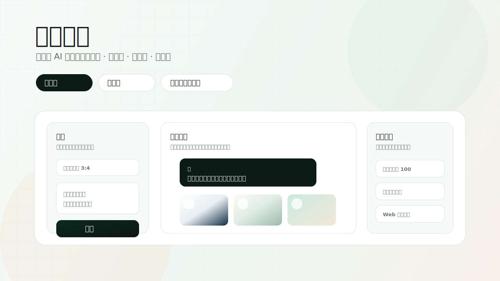
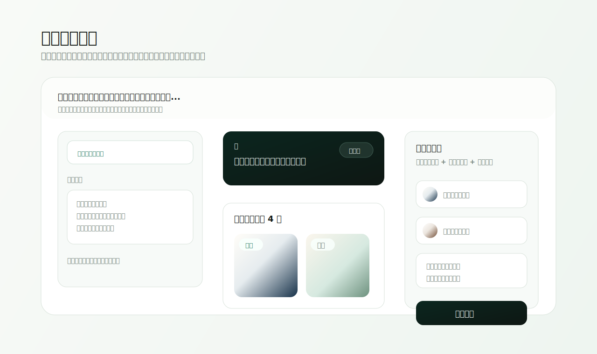
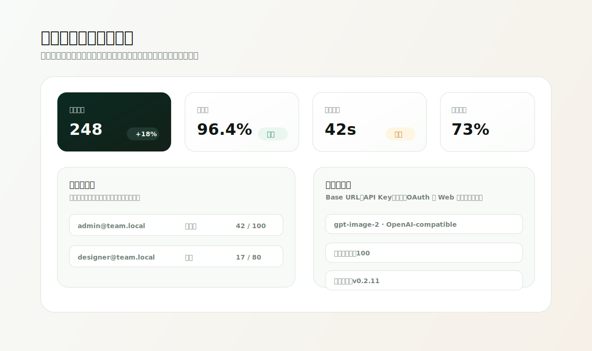
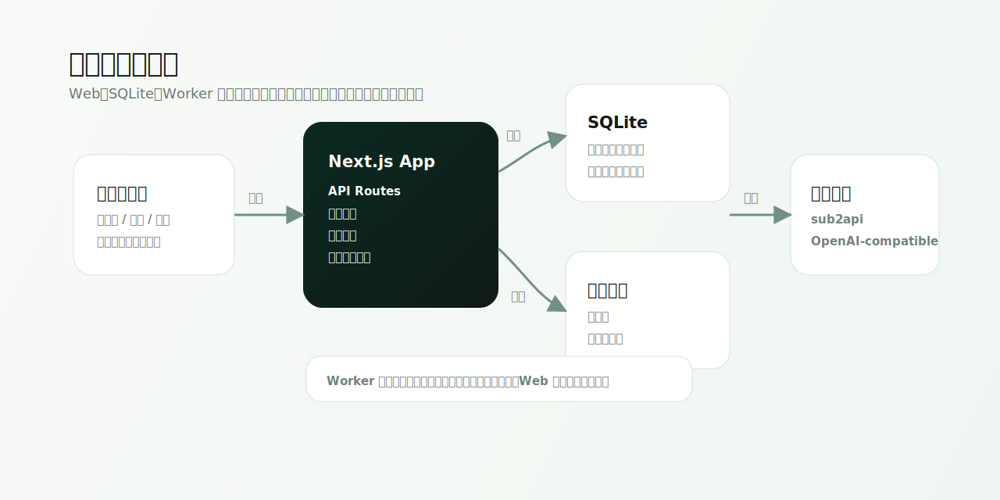
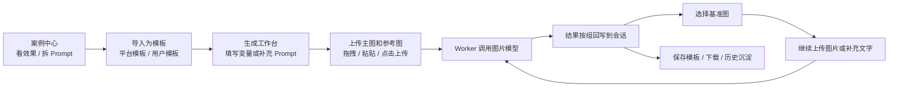

# Canvas Realm Studio / 画境工坊

<p align="center">
  <strong>Self-hosted GPT Image 2 / Image-2 workbench for teams</strong><br />
  团队级、自托管、会话式 AI 图片生成工作台
</p>

<p align="center">
  <a href="https://github.com/laolin5564/canvas-realm-gpt-image-2-studio/releases"></a>
  <a href="https://github.com/laolin5564/canvas-realm-gpt-image-2-studio/blob/main/LICENSE"></a>
  
  
  
  
</p>

<p align="center">
  <a href="#中文">中文</a>
  ·
  <a href="#english">English</a>
</p>



Canvas Realm Studio is the English name for 画境工坊: `Canvas` for 画, `Realm` for 境, and `Studio` for 工坊. The repository name keeps the product meaning while carrying the searchable `gpt-image-2` / `image-2` keywords.

Keywords: `gpt-image-2`, `image-2`, `GPT Image 2 web UI`, `AI image generator`, `OpenAI-compatible`, `sub2api`, `text-to-image`, `image-to-image`, `self-hosted`, `Next.js`, `SQLite`.

This is an independent open-source project and is not affiliated with OpenAI.

## 中文

Canvas Realm Studio（画境工坊）是一套轻量、可自托管的 AI 图片生成系统。它把文生图、图生图、会话上下文、固定提示词、模板、历史记录、用户账号、分组额度、模型配置和在线更新整合到一个清爽的内部工作台里。

它适合内容团队、电商团队、设计工作室、自媒体团队和公司内部工具场景。你可以把 OpenAI-compatible 图片接口、sub2api，或实验性的内置 OpenAI OAuth 账号连接器包装成一个团队可用、可运营、可追溯的图片生成平台。

画境工坊现在内置独立的 **案例中心**：效果库同步 `awesome-gpt-image-2` 的 375 个案例用于浏览方向，灵感库把高价值场景拆成中文生产提示词、Prompt 拆解、反向避坑和一键转模板。源项目图片只作为来源预览，日常复制和导入默认使用中文提示词，方便后续用自己的 image-2 接口批量生成自有示例图。

### 一眼看懂

| 你想解决的问题 | Canvas Realm Studio 怎么做 |
| --- | --- |
| 团队成员都在不同工具里生成图片，资产散落 | 统一工作台 + 历史记录 + 会话沉淀 |
| 同一套提示词要批量处理很多图片 | 会话固定提示词 + 主图/参考图角色 |
| 多图结果太散，后续不知道基于哪张改 | 多图按组展示，选择基准图后继续图生图 |
| 模型接口经常超时或失败，用户看不懂报错 | 错误分类、队列状态、重试和并发配置 |
| 管理员要控制账号和额度 | 用户、分组、月额度、用量统计 |
| 不知道该怎么写 Prompt 或参考什么效果 | 案例中心、中文提示词、Prompt 拆解器、一键导入模板 |
| 常用风格、平台比例、提示词要复用 | 平台模板 + 用户模板 |
| 私有部署后还要升级 | GitHub Releases 检查 + 受限 Web 一键更新 |

### 产品预览

每次生成都会进入一个会话。后续你可以继续发文字、上传图片、选择基准图，系统会在同一个上下文里继续处理。



后台不只是配置页，而是运营入口：账号、分组、额度、模型、并发、健康状态、自动清理和在线更新都集中管理。



Web、SQLite、Worker、文件存储和模型接口拆分清晰，部署简单，也方便后续二开。



### 核心能力

| 模块 | 能力 |
| --- | --- |
| 生成工作台 | 文生图、图生图、平台比例、多图成组、停止与重新生成 |
| 案例中心 | 效果库、灵感库、中文 Prompt、原文溯源、筛选、复制、导入模板 |
| 会话上下文 | 固定提示词、选择基准图、上传主图和参考图、连续处理 |
| 历史与素材 | 关键词筛选、单张删除、多选删除、下载、复制 prompt、保存模板 |
| 模板体系 | 管理员平台模板、用户私有模板、从历史图或会话提示词保存模板 |
| 账号额度 | 注册登录、管理员认证、分组、月额度、用量统计 |
| 模型配置 | Base URL、API Key、模型名、并发数、OAuth 账号连接器 |
| 运维能力 | 错误分类、健康统计、图片自动清理、Web 一键更新 |

### 推荐工作流



### 图片接口模式

| 模式 | 状态 | 说明 |
| --- | --- | --- |
| sub2api / OpenAI-compatible API Key | 推荐 | 使用 `Authorization: Bearer <API Key>` 调用兼容图片接口 |
| 内置 OpenAI OAuth | 实验性 | 参考 Codex OAuth + PKCE 流程，服务端加密保存 token |

内置 OAuth 支持在后台配置 `http://`、`https://`、`socks5://`、`socks5h://` 代理，用于服务端 token 交换、刷新和图片请求。

### 快速开始

本地开发：

```bash
bun install
cp .env.example .env.local
bun run db:init
bun run dev:all
```

打开：

```text
http://localhost:3000
```

首次注册的账号会自动成为管理员。

Docker 部署：

```bash
git clone https://github.com/laolin5564/canvas-realm-gpt-image-2-studio.git
cd canvas-realm-gpt-image-2-studio
cp .env.example .env
SUB2API_API_KEY=your_api_key docker compose up -d --build
```

默认访问：

```text
http://服务器IP:3000
```

### 常用环境变量

复制 `.env.example` 后按需修改：

| 变量 | 默认值 | 说明 |
| --- | --- | --- |
| `SUB2API_BASE_URL` | `https://your-sub2api.example.com/v1` | OpenAI-compatible 图片接口地址 |
| `SUB2API_API_KEY` | 空 | 图片接口密钥 |
| `IMAGE_MODEL` | `gpt-image-2` | 图片模型名 |
| `IMAGE_STORAGE_DIR` | `./data/images` | 图片存储目录 |
| `DATABASE_URL` | `file:./data/app.db` | SQLite 数据库路径 |
| `IMAGE_REQUEST_TIMEOUT_MS` | `300000` | 模型请求超时时间 |
| `WORKER_POLL_INTERVAL_MS` | `3000` | Worker 轮询间隔 |
| `APP_BASE_URL` | 空 | 部署域名，用于部分回调和 Cookie 判断 |
| `SESSION_COOKIE_SECURE` | `false` | HTTPS 部署建议设为 `true` |
| `WEB_UPDATE_ENABLED` | `false` | 是否允许后台触发 Web 一键更新 |
| `WEB_UPDATE_REPO_DIR` | `/app` | Web 更新执行目录 |
| `OPENAI_OAUTH_TOKEN_ENCRYPTION_KEY` | 空 | 内置 OAuth token 加密 key |

内置 OAuth 模式必须配置 `OPENAI_OAUTH_TOKEN_ENCRYPTION_KEY`。建议使用 32 字节以上随机字符串，或 `base64:` 前缀的 32 字节 key。丢失该 key 后，已保存 token 无法解密，需要重新连接账号。

### 项目结构

```text
app/                    Next.js 页面和 API 路由
components/             前端客户端组件
lib/                    配置、数据库、权限、队列、模型接口
workers/image-worker.ts 图片生成 Worker
scripts/                初始化、更新和安全扫描脚本
docs/                   架构文档和 README 插图
data/                   本地数据库和图片，默认不入库
```

更多维护说明见 [docs/ARCHITECTURE.md](docs/ARCHITECTURE.md)。

### 常用命令

```bash
bun run dev          # 启动 Next.js 开发服务
bun run worker       # 启动图片生成 Worker
bun run dev:all      # 同时启动 Web 和 Worker
bun run db:init      # 初始化数据库和内置模板
bun run build        # 构建生产版本
bun run start        # 启动生产 Web 服务
bun run lint         # ESLint 检查
bun run typecheck    # TypeScript 类型检查
bun test             # 单元测试
bun run secret:scan  # 扫描常见密钥格式
```

### 在线更新

后台「系统更新」会读取 GitHub Releases latest API：

- 当前版本来自 `package.json`。
- 最新版本来自 `UPDATE_CHECK_URL`。
- 是否可更新通过 semver 比较。

手动更新：

```bash
cd /path/to/canvas-realm-gpt-image-2-studio
bash scripts/update.sh
```

Web 一键更新默认关闭。启用前请确认你理解 Docker socket 权限风险：

```bash
WEB_UPDATE_ENABLED=true WEB_UPDATE_REPO_DIR="$PWD" docker compose up -d --build
```

Docker Compose 需要挂载：

```yaml
volumes:
  - ./data:/app/data
  - ${WEB_UPDATE_REPO_DIR}:${WEB_UPDATE_REPO_DIR}
  - /var/run/docker.sock:/var/run/docker.sock
```

注意：容器内 `WEB_UPDATE_REPO_DIR` 必须指向宿主机 Git 项目的相同绝对路径，不能指向镜像内的 `/app`。

### 数据与安全

- 请不要把 `data/`、`.env*`、真实 API Key 或 token 提交到 Git。
- 应用启动时会自动初始化 schema；新增字段采用非破坏性 `ALTER TABLE ... ADD COLUMN`。
- 不要手动删除 `data/app.db` 来升级，这会清空用户、任务、模板和历史记录。
- 生产环境建议使用 HTTPS，并设置 `SESSION_COOKIE_SECURE=true`。
- Web 一键更新需要 Docker socket，等同于给容器宿主机 Docker 管理权限，只建议内网自用。

## English

Canvas Realm Studio is a self-hosted GPT Image 2 / Image-2 workbench for teams. It combines text-to-image, image-to-image, conversational context, pinned prompts, templates, history, accounts, group quotas, model settings and web-based updates into one internal production tool.

The product is designed for content teams, ecommerce teams, design studios, creator teams and internal company workflows. It can wrap an OpenAI-compatible image endpoint, sub2api, or the experimental built-in OpenAI OAuth connector into a team-friendly image generation platform.

It also ships with a dedicated **Case Center**. The effect gallery syncs 375 structured examples from `awesome-gpt-image-2` for visual exploration, while the inspiration gallery turns high-value scenarios into Chinese production prompts, prompt breakdowns, pitfalls and one-click template imports. Upstream images are shown as attributed previews only; copied and imported prompts default to Chinese so teams can regenerate their own Image-2 examples later.

### Why It Exists

| Problem | How Canvas Realm Studio Helps |
| --- | --- |
| Generated images are scattered across tools and users | One shared workspace with history and conversations |
| Many images need the same transformation prompt | Pinned conversation prompt + main/reference image roles |
| Multiple results become hard to manage | Results stay grouped, and one image can be selected as the next base |
| Model failures are hard for users to understand | Classified errors, queue status, retry actions and concurrency settings |
| Teams need usage limits | Accounts, groups, monthly quotas and usage stats |
| Users need inspiration before writing prompts | Case Center, Chinese prompts, prompt breakdowns and one-click template import |
| Common styles and platform ratios should be reusable | Platform templates and user templates |
| Self-hosted deployments need upgrades | GitHub Releases checks and restricted web update flow |

### Highlights

- Text-to-image and image-to-image workflows.
- Common ecommerce and content ratios for platforms such as Douyin, Xiaohongshu, WeChat articles and product shots.
- Generate 1, 2 or 4 images at once, with multi-image results grouped in one message.
- Upload, drag, paste and reuse reference images.
- Pinned conversation prompts for batch processing many images with one rule set.
- Continue generation from the selected base image plus uploaded references and new text instructions.
- Stop running tasks and regenerate failed or stopped tasks.
- Case Center with effect gallery, inspiration gallery, Chinese prompt drafts, original-source traceability and template import.
- Platform templates managed by admins and private templates saved by users.
- Admin dashboard for accounts, groups, quotas, model config, health stats and update checks.

### API Modes

| Mode | Status | Notes |
| --- | --- | --- |
| sub2api / OpenAI-compatible API Key | Recommended | Calls image endpoints with `Authorization: Bearer <API Key>` |
| Built-in OpenAI OAuth | Experimental | Stores encrypted tokens server-side and follows a Codex-style OAuth + PKCE flow |

The OAuth connector supports optional `http://`, `https://`, `socks5://` and `socks5h://` proxies for token exchange, token refresh and image requests.

### Stack

| Layer | Tech |
| --- | --- |
| Web | Next.js App Router, React, TypeScript |
| Database | SQLite, `node:sqlite` |
| Worker | Dedicated image generation worker |
| Runtime | Bun, Node.js |
| Deployment | Docker, Docker Compose |
| UI | CSS variables, lucide-react |

### Quick Start

Local development:

```bash
bun install
cp .env.example .env.local
bun run db:init
bun run dev:all
```

Open:

```text
http://localhost:3000
```

The first registered user becomes the admin.

Docker:

```bash
git clone https://github.com/laolin5564/canvas-realm-gpt-image-2-studio.git
cd canvas-realm-gpt-image-2-studio
cp .env.example .env
SUB2API_API_KEY=your_api_key docker compose up -d --build
```

Default data paths:

| Path | Purpose |
| --- | --- |
| `data/app.db` | SQLite database |
| `data/images/` | Generated images and uploaded assets |
| `backups/` | Backups created by update scripts |

### Common Commands

```bash
bun run dev          # Start the Next.js dev server
bun run worker       # Start the image generation worker
bun run dev:all      # Start Web and Worker together
bun run db:init      # Initialize database and built-in templates
bun run build        # Build for production
bun run start        # Start production Web server
bun run lint         # Run ESLint
bun run typecheck    # Run TypeScript checks
bun test             # Run tests
bun run secret:scan  # Scan common secret patterns
```

### Update Flow

Manual update:

```bash
cd /path/to/canvas-realm-gpt-image-2-studio
bash scripts/update.sh
```

Web update is disabled by default because it requires Docker socket access. Enable it only for trusted private deployments:

```bash
WEB_UPDATE_ENABLED=true WEB_UPDATE_REPO_DIR="$PWD" docker compose up -d --build
```

### Security Notes

- Never commit `data/`, `.env*`, API keys or OAuth tokens.
- Production deployments should use HTTPS and `SESSION_COOKIE_SECURE=true`.
- The built-in OAuth connector stores encrypted tokens, but it is still experimental.
- Web updates require Docker socket access, which effectively grants Docker control on the host.

### Roadmap

- Multi-provider health checks and automatic failover.
- Retry with another model or lower concurrency.
- Asset library, favorites and batch download.
- Export platform-ready image packs.
- Object storage support, such as S3 / R2 / OSS.
- Team spaces, projects and a template marketplace.

## License

MIT
