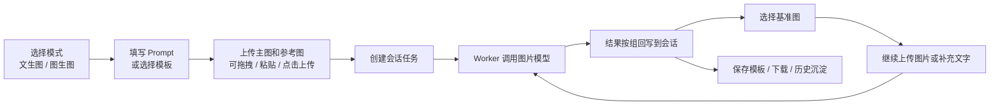

# 画境工坊

<p align="center">
  <strong>面向团队和私有部署的 AI 图片生成工作台</strong>
</p>

<p align="center">
  <a href="https://github.com/laolin5564/huajing-studio/releases"></a>
  <a href="https://github.com/laolin5564/huajing-studio/blob/main/LICENSE"></a>
  
  
  
  
</p>


画境工坊是一套轻量、可自托管的 AI 图片生成系统。它把文生图、图生图、会话上下文、固定提示词、模板、历史记录、用户账号、分组额度、模型配置和在线更新整合到一个清爽的内部工作台里。

它适合内容团队、电商团队、设计工作室、自媒体团队和公司内部工具场景。你可以把 OpenAI-compatible 图片接口、sub2api，或实验性的内置 OpenAI OAuth 账号连接器包装成一个团队可用、可运营、可追溯的图片生成平台。

## 一眼看懂

| 你想解决的问题 | 画境工坊怎么做 |
| --- | --- |
| 团队成员都在不同工具里生成图片，资产散落 | 统一工作台 + 历史记录 + 会话沉淀 |
| 同一套提示词要批量处理很多图片 | 会话固定提示词 + 主图/参考图角色 |
| 多图结果太散，后续不知道基于哪张改 | 多图按组展示，选择基准图后继续图生图 |
| 模型接口经常超时或失败，用户看不懂报错 | 错误分类、队列状态、重试和并发配置 |
| 管理员要控制账号和额度 | 用户、分组、月额度、用量统计 |
| 常用风格、平台比例、提示词要复用 | 平台模板 + 用户模板 |
| 私有部署后还要升级 | GitHub Releases 检查 + 受限 Web 一键更新 |

## 产品预览

### 会话式生成工作台

每次生成都会进入一个会话。后续你可以继续发文字、上传图片、选择基准图，系统会在同一个上下文里继续处理。


### 管理员后台

后台不只是配置页，而是运营入口：账号、分组、额度、模型、并发、健康状态、自动清理和在线更新都集中管理。


### 自托管架构

Web、SQLite、Worker、文件存储和模型接口拆分清晰，部署简单，也方便后续二开。


## 核心能力

### 生成工作台

- 支持文生图、图生图两种核心模式。
- 支持常见平台比例，例如抖音封面、小红书封面、公众号头图、电商主图。
- 支持一次生成 1 / 2 / 4 张，多图结果按一组展示。
- 支持上传、拖拽、复制粘贴参考图。
- 支持会话固定提示词，适合一套规则批量处理很多图片。
- 支持生成中停止，失败或停止后可重新生成。
- 支持在会话里基于选中图、上传参考图和文字补充继续生成。

### 历史与素材

- 历史记录按时间倒序展示，可按关键词、模式、模板筛选。
- 支持单张删除和选择模式下的多选删除。
- 图片可下载、复制 prompt、再生成、转图生图、保存为模板。
- 管理员可配置历史图片自动删除天数，避免本地磁盘无限增长。

### 模板体系

- 平台模板：管理员维护，对所有用户可见。
- 用户模板：注册用户自己保存，只归属当前账号。
- 支持从历史图片保存模板。
- 支持从会话固定提示词保存模板。
- 模板可预设 prompt、负面词、尺寸比例、参考强度、风格强度。

### 账号与额度

- 用户注册、登录和管理员认证。
- 第一个注册用户自动成为管理员。
- 用户可被分配到不同分组。
- 分组和用户都可以设置月额度。
- 顶部实时展示当前账号用量。

### 模型与稳定性

- 支持 OpenAI-compatible 图片接口。
- 支持 sub2api API Key 模式。
- 支持实验性内置 OpenAI OAuth 账号连接器。
- 支持模型 Base URL、API Key、模型名、并发请求数后台配置。
- 支持错误分类：超时、权限不足、余额不足、模型不存在、图片过大等。
- 支持队列状态展示：排队中、生成中、完成、失败、已停止。

## 推荐工作流



## 图片接口模式

| 模式 | 状态 | 说明 |
| --- | --- | --- |
| sub2api / OpenAI-compatible API Key | 推荐 | 使用 `Authorization: Bearer <API Key>` 调用兼容图片接口 |
| 内置 OpenAI OAuth | 实验性 | 参考 Codex OAuth + PKCE 流程，服务端加密保存 token |

内置 OAuth 支持在后台配置 `http://`、`https://`、`socks5://`、`socks5h://` 代理，用于服务端 token 交换、刷新和图片请求。

## 技术栈

| 层级 | 技术 |
| --- | --- |
| Web | Next.js App Router, React, TypeScript |
| 数据 | SQLite, `node:sqlite` |
| Worker | 独立图片队列 Worker |
| 运行时 | Bun, Node.js |
| 部署 | Docker, Docker Compose |
| UI | CSS variables, lucide-react |

## 快速开始

### 本地开发

```bash
bun install
cp .env.example .env.local
bun run db:init
bun run dev:all
```

打开：

```text
http://localhost:3000
```

首次注册的账号会自动成为管理员。

### Docker 部署

```bash
git clone https://github.com/laolin5564/huajing-studio.git
cd huajing-studio
cp .env.example .env
SUB2API_API_KEY=your_api_key docker compose up -d --build
```

默认访问：

```text
http://服务器IP:3000
```

默认数据目录：

| 路径 | 内容 |
| --- | --- |
| `data/app.db` | SQLite 数据库 |
| `data/images/` | 生成图和上传素材 |
| `backups/` | 更新脚本产生的备份 |

请不要把 `data/`、`.env*`、真实 API Key 或 token 提交到 Git。

## 环境变量

复制 `.env.example` 后按需修改。最常用配置如下：

| 变量 | 默认值 | 说明 |
| --- | --- | --- |
| `SUB2API_BASE_URL` | `https://your-sub2api.example.com/v1` | OpenAI-compatible 图片接口地址 |
| `SUB2API_API_KEY` | 空 | 图片接口密钥 |
| `IMAGE_MODEL` | `gpt-image-2` | 图片模型名 |
| `IMAGE_STORAGE_DIR` | `./data/images` | 图片存储目录 |
| `DATABASE_URL` | `file:./data/app.db` | SQLite 数据库路径 |
| `IMAGE_REQUEST_TIMEOUT_MS` | `300000` | 模型请求超时时间 |
| `WORKER_POLL_INTERVAL_MS` | `3000` | Worker 轮询间隔 |
| `COST_PER_IMAGE` | `0.04` | 每张图成本估算，仅用于统计 |
| `APP_BASE_URL` | 空 | 部署域名，用于部分回调和 Cookie 判断 |
| `SESSION_COOKIE_SECURE` | `false` | HTTPS 部署建议设为 `true` |
| `WEB_UPDATE_ENABLED` | `false` | 是否允许后台触发 Web 一键更新 |
| `WEB_UPDATE_REPO_DIR` | `/app` | Web 更新执行目录 |
| `OPENAI_OAUTH_TOKEN_ENCRYPTION_KEY` | 空 | 内置 OAuth token 加密 key |
| `OPENAI_OAUTH_REDIRECT_URI` | 空 | 可选，固定 OAuth 回调地址 |
| `OPENAI_OAUTH_CLIENT_ID` | 空 | 可选，覆盖默认 OAuth client id |

内置 OAuth 模式必须配置 `OPENAI_OAUTH_TOKEN_ENCRYPTION_KEY`。建议使用 32 字节以上随机字符串，或 `base64:` 前缀的 32 字节 key。丢失该 key 后，已保存 token 无法解密，需要重新连接账号。

## 项目结构

```text
app/                    Next.js 页面和 API 路由
components/             前端客户端组件
lib/                    配置、数据库、权限、队列、模型接口
workers/image-worker.ts 图片生成 Worker
scripts/                初始化、更新和安全扫描脚本
docs/                   架构文档和 README 插图
data/                   本地数据库和图片，默认不入库
```

关键模块：

| 文件 | 说明 |
| --- | --- |
| `lib/db.ts` | SQLite schema、兼容迁移、CRUD |
| `lib/auth.ts` | 登录态和 Session |
| `lib/permissions.ts` | 资源归属和访问控制 |
| `lib/image-provider.ts` | 图片接口调度 |
| `lib/queue.ts` | 队列任务处理 |
| `lib/model-error.ts` | 模型错误分类 |
| `lib/image-cleanup.ts` | 历史图片自动清理 |
| `scripts/update.sh` | 手动更新脚本 |
| `scripts/web-update.sh` | 后台受限更新脚本 |

更多维护说明见 [docs/ARCHITECTURE.md](docs/ARCHITECTURE.md)。

## 常用命令

```bash
bun run dev          # 启动 Next.js 开发服务
bun run worker       # 启动图片生成 Worker
bun run dev:all      # 同时启动 Web 和 Worker
bun run db:init      # 初始化数据库和内置模板
bun run build        # 构建生产版本
bun run start        # 启动生产 Web 服务
bun run lint         # ESLint 检查
bun run typecheck    # TypeScript 类型检查
bun test             # 单元测试
bun run secret:scan  # 扫描常见密钥格式
```

发布前建议执行：

```bash
bun run typecheck
bun run lint
bun test
node --import tsx --test tests/*.node.ts
bun run build
```

## 在线更新

后台「系统更新」会读取 GitHub Releases latest API：

- 当前版本来自 `package.json`。
- 最新版本来自 `UPDATE_CHECK_URL`。
- 是否可更新通过 semver 比较。

### 手动更新

```bash
cd /path/to/huajing-studio
bash scripts/update.sh
```

指定版本：

```bash
UPDATE_TAG=v0.2.11 bash scripts/update.sh
```

脚本会先备份 `data/` 和 `.env*` 到 `backups/`，再拉取版本、切换 tag，并执行 `docker compose up -d --build`。

### Web 一键更新

默认关闭。启用前请确认你理解 Docker socket 权限风险。

```bash
WEB_UPDATE_ENABLED=true WEB_UPDATE_REPO_DIR="$PWD" docker compose up -d --build
```

Docker Compose 需要挂载：

```yaml
volumes:
  - ./data:/app/data
  - ${WEB_UPDATE_REPO_DIR}:${WEB_UPDATE_REPO_DIR}
  - /var/run/docker.sock:/var/run/docker.sock
```

注意：容器内 `WEB_UPDATE_REPO_DIR` 必须指向宿主机 Git 项目的相同绝对路径，不能指向镜像内的 `/app`。

## 数据与安全

- 应用启动时会自动初始化 schema；新增字段采用非破坏性 `ALTER TABLE ... ADD COLUMN`。
- 不要手动删除 `data/app.db` 来升级，这会清空用户、任务、模板和历史记录。
- 更新前脚本会备份 `data/` 和 `.env*`。
- 生产环境建议使用 HTTPS，并设置 `SESSION_COOKIE_SECURE=true`。
- 内置 OAuth token 会加密保存，但仍建议只在可信内网环境使用实验性 OAuth 模式。
- Web 一键更新需要 Docker socket，等同于给容器宿主机 Docker 管理权限，只建议内网自用。

## 路线图

- 多模型健康检测和自动切换。
- 任务失败后的换模型重试。
- 素材库、收藏夹和批量下载。
- 平台规格包导出。
- 对象存储支持，例如 S3 / R2 / OSS。
- 团队空间、项目管理和模板市场。

## License

MIT
